## BERUF MAP

Fixed SVG map · position = topology · hue = lineage · lightness = depth · shape = entity type.

Structural IDs keep the family logic explicit outside the graphic itself:
**C1** is the LEBENSBUND branch, **C2** is the FOP / institutional branch,
and deeper IDs record child lineage while allowing siblings to keep distinct
identifiers even when they share the same depth shade.

  

<strong>Lineage color system / structural IDs</strong>

 

<pre>
LINEAGE COLOR SYSTEM

BERUF / historical neutral
  carrier         #475569
  role / context  #64748B
  historical      #94A3B8

C1 · LEBENSBUND
  C1 root         #9F1239
  depth +1        #E11D48
  depth +2        #FB7185

C2 · FOP / institutional lineage
  C2 root         #92400E
  depth +1        #B45309
  depth +2        #D97706
  depth +3        #F59E0B

STRUCTURAL IDS

C1       LEBENSBUND
├── C1.1 Family Relocation to Spouse's Home Country
└── C1.2 Parenthood / Tykhon

C2       FOP Oksana Dubinetska
└── C2.1 Zhovten Games
    ├── C2.1.1 InterDead
    └── C2.1.2 IRON CREED

RULES

hue       = lineage
lightness = lineage depth
position  = topology / relation to BERUF
shape     = entity type

Sibling IDs are distinct even when their depth shade is identical.
Marriage and professional roles remain neutral BERUF nodes; they are
intersection / origin points, not color roots.

LEBENSBUND ↔ FOP is an intersection, not derivation. Its map edge uses
a rose → amber transition and a dashed stroke.

OUTSIDE THE MAP

Markdown cannot reliably reproduce exact lineage colors in text.
Visible headings and important cross-indexes therefore carry structural
IDs such as [C2], [C2.1], [C2.1.1], and [C2.1.2].
Monospace trees keep the same IDs where doing so improves orientation.
</pre>

<strong>Historical Mermaid version</strong> · preserved as a historical / compatibility reference

 

```mermaid
block-beta
    columns 10

    %% ─────────────────────────────────────
    %% DERIVED PROJECTS / LONG-HORIZON COMMITMENTS
    %% ─────────────────────────────────────

    space:2
    RL["C1.1<br/>Family Relocation<br/>to Spouse's Home Country"]
    PT["C1.2<br/>Parenthood<br/>Tykhon"]
    space:3
    ID["C2.1.1<br/>InterDead"]
    space:2

    %% ─────────────────────────────────────
    %% SHARED-LIFE / ACTIVE SYSTEM
    %% ─────────────────────────────────────

    space:2
    LB["C1<br/>LEBENSBUND"]
    space:3
    FOP["C2<br/>FOP Oksana<br/>Dubinetska"]
    ZGS["C2.1<br/>Zhovten Games"]
    ICS["C2.1.2<br/>IRON CREED"]
    space

    %% ─────────────────────────────────────
    %% BERUF — MAIN HORIZONTAL CARRIER
    %% ─────────────────────────────────────

    B["BERUF"]
    H["2011<br/>Technical Help Desk<br/>Specialist"]
    M["2015<br/>Marriage"]
    T["2015<br/>Software Test<br/>Engineer"]
    S["2017<br/>Project Manager<br/>Copywriting Team"]
    W["2019<br/>Junior Full-Stack<br/>Web Engineer"]
    F["2021<br/>Middle Full-Stack<br/>Web Engineer"]
    ZG["2025<br/>Game Systems Designer<br/>/ Co-Founder"]
    IC["2026<br/>Senior Full-Stack Web Engineer<br/>/ Engineering Mentor<br/>/ Co-Founder"]
    space

    %% ─────────────────────────────────────
    %% HISTORICAL / COMPLETED — DOWN
    %% ─────────────────────────────────────

    space
    UC["uCoz"]
    space
    UK["uKit"]
    SC["Scuba Space"]
    ZP["ZIPY HOLDINGS LTD."]
    FR["Freelance"]
    space:3

    %% ─────────────────────────────────────
    %% MAIN HORIZONTAL CARRIER
    %% ─────────────────────────────────────

    B --- H
    H --- M
    M --- T
    T --- S
    S --- W
    W --- F
    F --- ZG
    ZG --- IC

    %% ─────────────────────────────────────
    %% UPPER HORIZONTAL SYSTEM
    %% ─────────────────────────────────────

    LB --- FOP
    FOP --- ZGS
    ZGS --- ICS

    %% ─────────────────────────────────────
    %% UPWARD BRANCHES
    %% ─────────────────────────────────────

    M --- LB
    F --- FOP
    ZG --- ZGS
    IC --- ICS

    %% Derived commitments / projects
    LB --- RL
    LB --- PT

    %% InterDead is a Zhovten Games subproject
    ZGS --- ID

    %% ─────────────────────────────────────
    %% DOWNWARD / HISTORICAL BRANCHES
    %% ─────────────────────────────────────

    H --- UC
    UC --- UK
    T --- UK
    S --- SC
    W --- ZP
    F --- FR

    %% ─────────────────────────────────────
    %% VISUAL LANGUAGE — historical Mermaid layer
    %% ─────────────────────────────────────

    classDef neutral fill:#ffffff,stroke:#64748B,color:#18202A,stroke-width:1px;
    classDef c1root fill:#FFF1F2,stroke:#9F1239,color:#4C0519,stroke-width:1.75px;
    classDef c1child fill:#FFF7F8,stroke:#E11D48,color:#4C0519,stroke-width:1.5px;
    classDef c2root fill:#FFFBEB,stroke:#92400E,color:#451A03,stroke-width:1.75px;
    classDef c2child fill:#FFF7ED,stroke:#B45309,color:#451A03,stroke-width:1.5px;
    classDef c2grand fill:#FFF7ED,stroke:#D97706,color:#451A03,stroke-width:1.5px;
    classDef label fill:#0000,stroke:#0000,color:#18202A,font-weight:bold;

    class B label;
    class H,M,T,S,W,F,ZG,IC,UC,UK,SC,ZP,FR neutral;
    class LB c1root;
    class RL,PT c1child;
    class FOP c2root;
    class ZGS c2child;
    class ID,ICS c2grand;
```

### How to read the map

`BERUF` is the carrier of this map.

The term is used partly in the Weberian sense: in *The Protestant Ethic and the Spirit of Capitalism*, **Beruf** carries both the ordinary meaning of occupation and the older sense of a calling or vocation. This map borrows that ambiguity, but extends it into a practical model of professional life.

Here, the carrier represents the allocation of the primary non-renewable resource: **time**. Every role occupies part of that resource; projects, organizations, and longer-lived systems branch from the points where that time was invested.

The visual model is deliberately closer to a **road map** than to a conventional résumé or organization chart: roles are stops on the main route, while companies, projects, systems, and artifacts appear as connected branches.

Color is deliberately orthogonal to position. **BERUF and its role chronology remain neutral.** A hue begins only when a durable lineage or system contour is established; lighter shades of the same hue indicate greater lineage depth. Entity type is expressed by shape rather than by assigning a new hue.

`STACK` is local to the node where it appears. It describes the technologies, languages, runtimes, platforms, architectural approaches, production methods, and tooling actually used in that context. Reusable parts of a stack are referenced through versioned `STACKSET`s rather than copied repeatedly.

<pre>
LINE SEMANTICS

BERUF ─────────────  chronological carrier
                     professional path / finite time allocation

        │
        ├── ABOVE    continuing life structures, intentional undertakings,
        │            personal milestones, active systems, and structures
        │            that outlive a single role or period
        │
        └── BELOW    historical work contexts
                     organizations attached to the role in which
                     that work was performed

VERTICAL LINKS       derivation, attachment, ownership, or emergence

SECONDARY
HORIZONTAL LINKS     continuity, lineage, or institutional derivation
                     between longer-lived systems; they do not represent
                     time unless they are part of the BERUF carrier

STACK                 effective context-local technical /
                      production stack

STACKSET              reusable versioned stack definition

PROJECT               intentional undertaking derived from a larger life,
                      professional, or institutional system; in this map
                      the term includes commercial, technical, creative,
                      familial, and civic undertakings

SUBPROJECT            independently identifiable project layer
                      belonging to a larger project or system

ARTIFACT              bounded output that may outlive the work period:
                      repository / application / publication /
                      build / pipeline / specification / release
</pre>

On the upper institutional line, adjacent nodes may have different functions.
<strong>FOP Oksana Dubinetska</strong> is the legal / contractual frame,
<strong>Zhovten Games</strong> is the studio / production system, and
<strong>IRON CREED</strong> is the applied IT / engineering practice of Zhovten Games.
Their horizontal connection expresses institutional continuity and derivation;
it does not make the three nodes equivalent in type.

In the family branch, project-level logic describes commitments and undertakings,
not people. <strong>Parenthood / Tykhon</strong> denotes the parental commitment
and responsibility established through his birth; Tykhon himself is an autonomous
person and is never modeled as a project or artifact.

<h3 id="presentation-rules">Presentation Rules</h3>

The map is the primary structural overview. The authored SVG version
remains permanently visible near the top of the profile, while
supporting color definitions and the historical Mermaid version are
progressively disclosed rather than rendered as one continuous document.

<pre>
PRESENTATION MODEL

ALWAYS VISIBLE
│
├── short map explanation
├── fixed SVG BERUF map
├── compact STACKSET registry
├── Contents
├── professional / system headings
└── Selected Projects & Artifacts overview

COLLAPSED BY DEFAULT
│
├── lineage color system / structural IDs
├── historical Mermaid version
├── STACK / STACKSET rules and definitions
├── role details
├── organization / system details
├── project architecture
├── subsystem implementation details
└── completed-work records

RULE
│
└── overview first → evidence and implementation on demand

DETAILS SHOULD
│
├── preserve stable anchors
├── contain self-sufficient blocks
├── keep important headings visible outside the disclosure
└── use summaries that remain meaningful when collapsed

HEADING HIERARCHY
│
├── H2 → BERUF role / cross-period institutional frame / major document section
├── H3 → direct child organization, practice, context, or project
└── H4 → nested project / subsystem under an H3 parent
</pre>

<h2 id="stack-model">Stack Model</h2>

A <strong>STACKSET</strong> is a reusable canonical bundle of technologies,
methods, platforms, runtimes, or production practices. A node does not
copy the bundle. It references one or more STACKSETs through
<strong>USE</strong> and records only its local differences through
<strong>OVERRIDE</strong>.

The resulting <strong>STACK</strong> is contextual: it is the combination
of all referenced STACKSETs after local overrides have been applied.

<strong>STACK / STACKSET rules, overrides and versioning</strong>

 

<pre>
STACK MODEL

STACK
│
├── USE
│   ├── STACKSET-A@1
│   ├── STACKSET-B@1
│   └── ...
│
└── OVERRIDE
    ├── ADD       → local component not present in referenced sets
    ├── REMOVE    → inherited component not used in this context
    ├── REPLACE   → explicit substitution of one component
    └── NOTE      → contextual qualification without changing membership

EFFECTIVE STACK
    = USE(STACKSET...)
    + ADD
    - REMOVE
    + REPLACE
    + NOTE
</pre>

<h3 id="stack-rules">Stack Rules</h3>

STACKSETs exist to normalize repeated technical context, not to create
a taxonomy entry for every technology that has ever appeared in the work.
A new STACKSET should represent either a reusable technical environment
that occurs in multiple independent contexts or a stable type of
engineering activity with enough internal structure to be meaningful
as a unit.

<pre>
STACKSET CREATION RULE

CREATE STACKSET when
│
├── the same coherent stack recurs across multiple contexts
│
└── OR
    the set represents a stable engineering / production discipline

KEEP AS OVERRIDE when
│
├── the technology is specific to one project or artifact
├── the component merely modifies a broader reusable stack
└── there is not yet enough stable context to define the bundle

COMPOSITION OVER INHERITANCE

preferred:

Node
├── USE → STACKSET-A@1
├── USE → STACKSET-B@1
└── OVERRIDE
    └── local differences

avoid:

STACK-A
└── STACK-B
    └── STACK-C
        └── PROJECT-SPECIFIC-STACK
</pre>

Overrides are intentionally explicit. They prevent a reusable STACKSET
from being duplicated merely because one project adds, removes, or
substitutes a small number of components.

<pre>
OVERRIDE RULES

ADD
│
└── introduces a component that belongs only to this context

REMOVE
│
└── explicitly excludes a component inherited through USE

REPLACE
│
└── records a real substitution rather than pretending that
    both inherited and replacement technologies were used

NOTE
│
└── qualifies scope, responsibility, maturity, or usage without
    changing the effective membership of the stack

EXAMPLE

InterDeadCore
│
└── STACK
    ├── USE → TYPESCRIPT-APPLICATION@1
    ├── USE → NODE-TOOLING@1
    ├── USE → HEXAGONAL-SYSTEMS@1
    │
    └── OVERRIDE
        ├── ADD  → @interdead/identity-core
        ├── ADD  → @interdead/efbd-scale
        ├── ADD  → @interdead/framework
        └── NOTE → web-side shared domain packages;
                   not the C++ Game Core
</pre>

STACKSET versions are historically stable. Once a version is referenced
by a historical role, project, or artifact, a material change creates a
new version rather than silently rewriting the old context.

<pre>
VERSIONING RULE

STACKSET@1
│
└── frozen once historical contexts depend on it

material change
│
└── create STACKSET@2

local difference
│
└── keep STACKSET@1 + OVERRIDE
</pre>

<h3 id="stackset-registry">Stackset Registry</h3>

<pre>
STACKSET REGISTRY
│
├── FOUNDATION / RUNTIMES
│   ├── SUPPORT-WEB@1
│   ├── QA-WEB@1
│   ├── EDITORIAL-PM@1
│   ├── WEB-FULLSTACK@1
│   ├── NODE-TOOLING@1
│   ├── TYPESCRIPT-APPLICATION@1
│   ├── UNIX-OPS@1
│   └── WINDOWS-AUTOMATION@1
│
├── PLATFORMS / DELIVERY
│   ├── WORDPRESS-WEB@1
│   ├── WEB-DELIVERY@1
│   ├── CLOUDFLARE-WEB@1
│   └── CONTAINERS-VIRTUALIZATION@1
│
└── ARCHITECTURE / METHODS
    ├── HEXAGONAL-SYSTEMS@1
    ├── GAME-SYSTEMS@1
    ├── PROCESS-OPTIMIZATION@1
    ├── RESEARCH-PUBLISHING@1
    ├── ENGINEERING-GOVERNANCE@1
    └── LLM-ENGINEERING@1
</pre>

<strong>STACKSET definitions</strong>

 

<pre>
SUPPORT-WEB@1
│
├── technical support
├── web-platform diagnostics
├── issue reproduction
├── Jira-based task flow
├── code-level troubleshooting
├── user communication
└── technical documentation

QA-WEB@1
│
├── functional testing
├── bug reproduction
├── system-behavior analysis
├── integration testing
├── verification
└── development-team collaboration

EDITORIAL-PM@1
│
├── recruitment
├── onboarding
├── task distribution
├── editorial review
├── team coordination
├── quality control
├── multilingual workflow
└── delivery control

WEB-FULLSTACK@1
│
├── HTML / CSS
├── JavaScript ES6+
├── PHP
├── SQL
├── REST APIs / Webhooks
└── Git

NODE-TOOLING@1
│
├── Node.js
├── JavaScript ES6+
├── ESM / CommonJS modules
├── CLI tooling
├── filesystem automation
├── build / transformation scripts
└── repository automation

TYPESCRIPT-APPLICATION@1
│
├── TypeScript
├── static typing
├── typed contracts
├── modular packages
├── type checking
└── TypeScript → JavaScript build flow

UNIX-OPS@1
│
├── Linux
├── BSD / Unix-like systems
├── Bash
├── SSH
├── deployment / administration
├── TCP/IP configuration
└── firewall / network configuration

WINDOWS-AUTOMATION@1
│
├── PowerShell
├── Windows shell automation
├── filesystem / repository tooling
├── Git workflow automation
└── local development environment scripting

WORDPRESS-WEB@1
│
├── WordPress
├── WooCommerce
├── custom plugin / module development
├── theme / frontend integration
└── production maintenance

WEB-DELIVERY@1
│
├── build processes
├── deployment
├── infrastructure integration
├── CI / CD
└── production verification

CLOUDFLARE-WEB@1
│
├── Cloudflare Pages
├── Cloudflare Workers
├── D1
├── KV
└── edge deployment

CONTAINERS-VIRTUALIZATION@1
│
├── Docker
├── VirtualBox
└── Hyper-V

HEXAGONAL-SYSTEMS@1
│
├── Hexagonal Architecture
├── Ports &amp; Adapters
├── dependency inversion
├── domain / infrastructure separation
├── replaceable adapters
└── explicit system boundaries

GAME-SYSTEMS@1
│
├── gameplay systems
├── narrative systems
├── technical design
├── prototyping
├── quest / progression logic
├── dependency / state modeling
└── project-system architecture

PROCESS-OPTIMIZATION@1
│
├── task decomposition
├── backlog structuring
├── phase planning
├── risk identification
├── acceptance criteria
└── workflow stabilization

RESEARCH-PUBLISHING@1
│
├── research
├── technical writing
├── documentation
├── reproducible publishing
└── research-to-engineering transfer

ENGINEERING-GOVERNANCE@1
│
├── architectural constraints
├── canonical-source discipline
├── documented development rules
├── review / verification
├── repository licensing policy
└── controlled change procedures

LLM-ENGINEERING@1
│
├── bounded task decomposition
├── explicit prompt contracts
├── human-authored planning
├── review / tests / smoke checks
└── traceable acceptance
</pre>

<h3 id="stackset-cpp-status">Why there is no C++ STACKSET yet</h3>

<strong>C++ normalization status and future STACKSET</strong>

 

C++ is intentionally not represented by a reusable STACKSET at this
stage. Its absence does not mean that C++ is outside the current work.
InterDead is moving toward an independent C++ Game Core, but that
runtime is still being formalized as a distinct engineering contour.

The stack model records verified technical contexts rather than broad
technology familiarity or intended future use. A useful C++ STACKSET
should therefore describe the actual runtime environment around the
language — build system, tests, dependency model, WebAssembly boundary,
Unreal adapter, runtime contracts, and related tooling — rather than
contain only the label “C++”.

<pre>
C++ STATUS

C++
│
├── current status
│   └── active / emerging game-runtime technology
│
├── known architectural position
│   ├── Scenario
│   │   └── separate linguistic source
│   │
│   └── C++ Game Core
│       ├── Unreal        → projection / adapter
│       └── Web / WASM    → projection / adapter
│
└── STACKSET status
    └── NOT YET DEFINED
        │
        ├── build system not fixed here
        ├── test stack not fixed here
        ├── dependency model not fixed here
        ├── WASM boundary still belongs to runtime design
        └── Unreal integration should be described from
            the implemented adapter rather than assumed

FUTURE

when the implementation contour is stable:

CXX-GAME-RUNTIME@1
│
├── C++
├── build system
├── testing
├── dependency / package model
├── WebAssembly boundary
├── Unreal adapter boundary
└── runtime-specific tooling
</pre>

This follows the same rule used elsewhere: a technology becomes part of
a STACKSET when there is enough concrete, reusable context to define the
set honestly. Until then it belongs to the project description or to a
local OVERRIDE if a specific artifact already uses it.

<h2 id="contents">Contents</h2>

<pre>
BERUF :: CONTENTS
│
├── 2026 · <a href="#role-2026-senior-full-stack">Senior Full-Stack Web Engineer / Engineering Mentor / Co-Founder</a>
│   │
│   ├── STACK
│   │   ├── USE → <a href="#stackset-web-fullstack-v1">WEB-FULLSTACK@1</a>
│   │   ├── USE → <a href="#stackset-unix-ops-v1">UNIX-OPS@1</a>
│   │   ├── USE → <a href="#stackset-web-delivery-v1">WEB-DELIVERY@1</a>
│   │   ├── USE → <a href="#stackset-engineering-governance-v1">ENGINEERING-GOVERNANCE@1</a>
│   │   ├── USE → <a href="#stackset-llm-engineering-v1">LLM-ENGINEERING@1</a>
│   │   └── <a href="#role-2026-senior-full-stack-stack">OVERRIDE</a>
│   │
│   └── [C2.1.2] <a href="#iron-creed">IRON CREED</a>
│       │
│       └── STACK
│           ├── USE → <a href="#stackset-web-fullstack-v1">WEB-FULLSTACK@1</a>
│           ├── USE → <a href="#stackset-unix-ops-v1">UNIX-OPS@1</a>
│           ├── USE → <a href="#stackset-web-delivery-v1">WEB-DELIVERY@1</a>
│           ├── USE → <a href="#stackset-cloudflare-web-v1">CLOUDFLARE-WEB@1</a>
│           ├── USE → <a href="#stackset-engineering-governance-v1">ENGINEERING-GOVERNANCE@1</a>
│           ├── USE → <a href="#stackset-research-publishing-v1">RESEARCH-PUBLISHING@1</a>
│           ├── USE → <a href="#stackset-llm-engineering-v1">LLM-ENGINEERING@1</a>
│           └── <a href="#iron-creed-stack">OVERRIDE</a>
│
├── 2025 · <a href="#role-2025-game-systems-designer">Game Systems Designer / Co-Founder</a>
│   │
│   ├── STACK
│   │   ├── USE → <a href="#stackset-game-systems-v1">GAME-SYSTEMS@1</a>
│   │   ├── USE → <a href="#stackset-engineering-governance-v1">ENGINEERING-GOVERNANCE@1</a>
│   │   └── <a href="#role-2025-game-systems-designer-stack">OVERRIDE</a>
│   │
│   └── [C2.1] <a href="#zhovten-games">Zhovten Games</a>
│       │
│       ├── STACK
│       │   ├── USE → <a href="#stackset-game-systems-v1">GAME-SYSTEMS@1</a>
│       │   ├── USE → <a href="#stackset-research-publishing-v1">RESEARCH-PUBLISHING@1</a>
│       │   ├── USE → <a href="#stackset-engineering-governance-v1">ENGINEERING-GOVERNANCE@1</a>
│       │   └── <a href="#zhovten-games-stack">OVERRIDE</a>
│       │
│       └── [C2.1.1] <a href="#interdead-project-map">InterDead</a>
│           │
│           ├── <a href="#interdead-canon">Canon / System Definition</a>
│           ├── <a href="#interdead-runtime">Source Code / Runtime Surfaces</a>
│           │   ├── <a href="#interdead-it">InterDeadIT</a>
│           │   ├── <a href="#interdead-proto">InterDeadProto / NOIR</a>
│           │   ├── <a href="#interdead-core">InterDeadCore</a>
│           │   └── <a href="#interdead-cpp-core">C++ Game Core — emerging</a>
│           │
│           └── <a href="#interdead-research">Research / Engineering Support</a>
│
├── 2021 · <a href="#role-2021-middle-full-stack">Middle Full-Stack Web Engineer</a>
│   │
│   ├── STACK
│   │   ├── USE → <a href="#stackset-web-fullstack-v1">WEB-FULLSTACK@1</a>
│   │   ├── USE → <a href="#stackset-wordpress-web-v1">WORDPRESS-WEB@1</a>
│   │   ├── USE → <a href="#stackset-web-delivery-v1">WEB-DELIVERY@1</a>
│   │   └── <a href="#role-2021-middle-full-stack-stack">OVERRIDE</a>
│   │
│   └── <a href="#freelance">Freelance</a>
│       ├── <a href="#freelance-stack">STACK / OVERRIDE</a>
│       └── client / project work
│
├── [C2] ↑ <a href="#fop-oksana-dubinetska">FOP Oksana Dubinetska</a>
│   └── legal / contractual frame spanning later roles and systems
│
├── 2019 · <a href="#role-2019-junior-full-stack">Junior Full-Stack Web Engineer</a>
│   │
│   ├── STACK
│   │   ├── USE → <a href="#stackset-web-fullstack-v1">WEB-FULLSTACK@1</a>
│   │   ├── USE → <a href="#stackset-wordpress-web-v1">WORDPRESS-WEB@1</a>
│   │   └── <a href="#role-2019-junior-full-stack-stack">OVERRIDE</a>
│   │
│   └── <a href="#zipy-holdings">ZIPY HOLDINGS LTD.</a>
│       │
│       ├── <a href="#zipy-holdings-stack">STACK / OVERRIDE</a>
│       │
│       └── <a href="#glenbotal">Glenbotal</a>
│           subscription-commerce platform
│
├── 2017 · <a href="#role-2017-project-manager">Project Manager / Copywriting Team</a>
│   │
│   ├── STACK
│   │   ├── USE → <a href="#stackset-editorial-pm-v1">EDITORIAL-PM@1</a>
│   │   └── <a href="#role-2017-project-manager-stack">OVERRIDE</a>
│   │
│   └── <a href="#scuba-space">Scuba Space</a>
│       └── <a href="#scuba-space-stack">STACK / OVERRIDE</a>
│
├── 2015 · <a href="#role-2015-software-test">Software Test Engineer</a>
│   │
│   ├── STACK
│   │   ├── USE → <a href="#stackset-qa-web-v1">QA-WEB@1</a>
│   │   └── <a href="#role-2015-software-test-stack">OVERRIDE</a>
│   │
│   └── <a href="#ukit">uKit</a>
│       └── <a href="#ukit-stack">STACK / OVERRIDE</a>
│
├── 2015 · <a href="#role-2015-marriage">Marriage</a>
│   │
│   └── [C1] <a href="#lebensbund">LEBENSBUND</a>
│       ├── [C1.1] Family Relocation to Spouse's Home Country
│       └── [C1.2] 2017 · Parenthood · Tykhon
│
└── 2011 · <a href="#role-2011-help-desk">Technical Help Desk Specialist</a>
    │
    ├── STACK
    │   ├── USE → <a href="#stackset-support-web-v1">SUPPORT-WEB@1</a>
    │   └── <a href="#role-2011-help-desk-stack">OVERRIDE</a>
    │
    └── <a href="#ucoz">uCoz</a>
        └── <a href="#ucoz-stack">STACK / OVERRIDE</a>

────────────────────────────────────────────────────────────────────

<a href="#selected-work">SELECTED PROJECTS &amp; ARTIFACTS</a>
│
├── <a href="#selected-projects">Projects</a>
│   ├── <a href="#project-interdead">InterDead</a>
│   └── <a href="#project-elaris-process-optimization">003 · Process Optimization — Elaris Studio Games</a>
│
├── <a href="#selected-artifacts">Artifacts</a>
│   ├── <a href="#artifact-ukit-kb">uKit Knowledge Base</a>
│   ├── <a href="#glenbotal">Glenbotal</a>
│   ├── <a href="#artifact-psyframework">PsyFramework</a>
│   ├── <a href="#artifact-safe-blind-zones">Safe / Blind Zones — Live Tester</a>
│   ├── <a href="#artifact-request-log">IRONCREED Request Log</a>
│   ├── <a href="#artifact-code-constitution">Code Constitution</a>
│   ├── <a href="#artifact-literate-programming">Literate Programming</a>
│   ├── <a href="#artifact-prompt-literate">Prompt-Literate Workflow</a>
│   ├── <a href="#artifact-canon-horror">Canon Horror Series</a>
│   ├── <a href="#artifact-zg-journal-template">ZG Journal Template</a>
│   └── <a href="#interdead-proto">InterDeadProto / NOIR</a>
│
└── <a href="#public-records">Public records</a>
    ├── <a href="#record-uhackathon">2015 · Closed uHackathon / uTeam</a>
    └── <a href="#record-wordpress-profile">WordPress.org · IRONCREED profile</a>
</pre>

---

<h2 id="role-2026-senior-full-stack">2026 · Senior Full-Stack Web Engineer / Engineering Mentor / Co-Founder</h2>

<strong>Role details · August 2026 → Present · IRON CREED</strong>

 

Since August 2026, I work through IRON CREED in a role that combines
hands-on full-stack engineering with systems architecture, infrastructure,
automation, delivery, technical documentation, verification, code review,
and engineering mentorship.

The role is broader in engineering scope than my parallel studio role at
Zhovten Games. It includes not only implementation, but also technical
direction, working methods, architectural decisions, review standards,
and the transfer of reusable engineering practices between projects.

<pre>
ROLE :: SENIOR FULL-STACK WEB ENGINEER / ENGINEERING MENTOR / CO-FOUNDER
│
├── PERIOD
│   └── August 2026 → Present
│
├── CONTEXT
│   └── [C2.1.2] <a href="#iron-creed">IRON CREED</a>
│
├── DESCRIPTION
│   ├── end-to-end web engineering
│   ├── systems architecture
│   ├── infrastructure and automation
│   ├── deployment and delivery
│   ├── security-oriented hardening
│   ├── technical documentation
│   ├── internal tooling
│   └── verification
│
├── RESPONSIBILITY
│   ├── hands-on engineering
│   ├── technical direction
│   ├── architectural decisions
│   ├── code review
│   ├── review / verification standards
│   ├── engineering mentorship
│   └── reusable-method transfer across projects
│
├── STACK
│   ├── USE → <a href="#stackset-web-fullstack-v1">WEB-FULLSTACK@1</a>
│   ├── USE → <a href="#stackset-unix-ops-v1">UNIX-OPS@1</a>
│   ├── USE → <a href="#stackset-web-delivery-v1">WEB-DELIVERY@1</a>
│   ├── USE → <a href="#stackset-engineering-governance-v1">ENGINEERING-GOVERNANCE@1</a>
│   ├── USE → <a href="#stackset-llm-engineering-v1">LLM-ENGINEERING@1</a>
│   │
│   └── OVERRIDE
│       ├── NOTE → architecture, review, mentoring and verification
│       │          are role-level responsibilities
│       ├── NOTE → platform-, runtime- and client-specific technologies
│       │          resolve on the corresponding child system,
│       │          project or artifact
│       └── NOTE → this role stack does not absorb the emerging
│                  InterDead C++ Game Core
│
└── SYSTEMS / PROJECTS
    └── [C2.1.2] <a href="#iron-creed">IRON CREED</a>
        applied IT and engineering practice
</pre>

---

<h3 id="iron-creed">[C2.1.2] ↳ IRON CREED</h3>

<strong>Practice scope, stack, working model and references</strong>

 

IRON CREED is the applied IT and engineering practice of Zhovten Games
and the personified engineering process behind its IT practice.

It connects development, infrastructure, automation, security, research,
technical publishing and verification into systems that can be understood,
verified and changed deliberately. Implementation, documentation,
research and verification are treated as connected parts of the same
engineering process rather than as unrelated stages.

<pre>
IRON CREED
│
├── LINEAGE
│   └── C2.1.2 · FOP Oksana Dubinetska → Zhovten Games → IRON CREED
│
├── TYPE
│   └── applied IT / engineering practice
│
├── PARENT
│   └── [C2.1] <a href="#zhovten-games">Zhovten Games</a>
│
├── LEGAL / CONTRACTUAL FRAME
│   └── <a href="#fop-oksana-dubinetska">FOP Oksana Dubinetska</a>
│
├── INSTITUTIONAL LINEAGE
│   └── [C2] FOP Oksana Dubinetska → [C2.1] Zhovten Games → [C2.1.2] IRON CREED
│
├── IDENTITY
│   ├── engineering practice
│   └── personified engineering process
│
├── SCOPE
│   ├── Systems Architecture
│   ├── Full-Stack Web Development
│   ├── DevOps / Infrastructure Engineering
│   ├── Cloudflare / Cloud Infrastructure
│   ├── Automation / CI/CD
│   ├── Security / Configuration Control
│   ├── Technical Documentation
│   ├── Technical Publishing
│   ├── Knowledge Engineering
│   ├── Corporate Knowledge for LLMs
│   ├── Machine-Readable Websites
│   └── Independent Verification
│
├── RESPONSIBILITY :: SAM
│   ├── Senior Full-Stack Web Engineer
│   ├── Engineering Mentor
│   ├── Co-Founder
│   ├── full-stack engineering
│   ├── systems architecture
│   ├── infrastructure
│   ├── automation
│   └── project verification
│
├── STACK
│   ├── USE → <a href="#stackset-web-fullstack-v1">WEB-FULLSTACK@1</a>
│   ├── USE → <a href="#stackset-unix-ops-v1">UNIX-OPS@1</a>
│   ├── USE → <a href="#stackset-web-delivery-v1">WEB-DELIVERY@1</a>
│   ├── USE → <a href="#stackset-cloudflare-web-v1">CLOUDFLARE-WEB@1</a>
│   ├── USE → <a href="#stackset-engineering-governance-v1">ENGINEERING-GOVERNANCE@1</a>
│   ├── USE → <a href="#stackset-research-publishing-v1">RESEARCH-PUBLISHING@1</a>
│   ├── USE → <a href="#stackset-llm-engineering-v1">LLM-ENGINEERING@1</a>
│   │
│   └── OVERRIDE
│       ├── NOTE → security and independent verification are
│       │          practice-wide concerns; concrete controls
│       │          resolve at project level
│       ├── NOTE → CMS, application runtime, containerization,
│       │          Node.js, TypeScript and other implementation
│       │          stacks are attached only where actually used
│       └── NOTE → game-runtime C++ is intentionally excluded:
│                  it belongs to InterDead under Zhovten Games
│
├── WORKING MODEL
│   ├── Governance
│   │   └── <a href="https://github.com/FOP-Oksana-Dubinetska/code-constitution">Code Constitution</a>
│   │       project rules / architectural constraints /
│   │       authority / change / verification
│   │
│   ├── Licensing
│   │   └── <a href="https://github.com/FOP-Oksana-Dubinetska/repository-licensing-policy">Repository Licensing Policy</a>
│   │       ownership / authorship / reuse /
│   │       distribution / licensing boundaries
│   │
│   └── LLM-assisted engineering
│       └── <a href="https://github.com/IRONCREED/prompt-literate-workflow">Prompt-Literate Workflow</a>
│           bounded generation / review /
│           validation / traceable acceptance
│
├── SYSTEMS / METHODS
│   ├── <a href="https://wordpress.org/plugins/ironcreed-request-log/">IRONCREED Request Log</a>
│   │   WordPress request-observation plugin / public directory release
│   │
│   ├── WARDEN
│   │   independent verification boundary
│   │   ├── route availability
│   │   ├── configuration integrity
│   │   ├── data structure
│   │   ├── security rules
│   │   ├── build correctness
│   │   ├── regressions
│   │   └── project-specific invariants
│   │
│   └── <a href="https://web.zhovten.games/en/pages/material-cycle">Material Cycle</a>
│       └── Idea or IT case
│           → Research and record
│           → IRON CREED adaptation
│           → Verification and the next change
│
└── REFERENCES
    ├── <a href="https://github.com/IRONCREED">GitHub organization</a>
    ├── <a href="https://github.com/IRONCREED/.github/blob/main/profile/README.md">Canonical GitHub profile</a>
    ├── <a href="https://profiles.wordpress.org/ironcreed/">WordPress.org profile</a>
    ├── <a href="https://wordpress.org/plugins/ironcreed-request-log/">IRONCREED Request Log</a>
    ├── <a href="https://web.zhovten.games/en/pages/about">About / public entry point</a>
    ├── <a href="https://www.linkedin.com/company/IRONCREED">LinkedIn</a>
    └── <a href="https://github.com/pan-canon">Sam / GitHub</a>
</pre>

---

<h2 id="role-2025-game-systems-designer">2025 · Game Systems Designer / Co-Founder</h2>

<strong>Role details · October 2025 → Present · Zhovten Games</strong>

 

Since October 2025, I work within Zhovten Games on gameplay systems,
technical design and the implementation layer that connects narrative
structure with executable game logic.

The role focuses on systems architecture and technical implementation:
quest and progression logic, state and dependency modelling, prototypes,
runtime integration, development constraints, and the translation of
design concepts into structures that can be implemented and maintained.

<pre>
ROLE :: GAME SYSTEMS DESIGNER / CO-FOUNDER
│
├── PERIOD
│   └── October 2025 → Present
│
├── CONTEXT
│   └── [C2.1] <a href="#zhovten-games">Zhovten Games</a>
│
├── DESCRIPTION
│   ├── gameplay systems
│   ├── technical design
│   ├── narrative-system integration
│   ├── quest / progression logic
│   ├── state / dependency modelling
│   ├── prototyping
│   └── technical implementation
│
├── RESPONSIBILITY
│   ├── gameplay systems architecture
│   ├── implementation-ready technical design
│   ├── system-level integration
│   ├── project architecture
│   ├── prototypes / tooling
│   └── engineering constraints for game systems
│
├── STACK
│   ├── USE → <a href="#stackset-game-systems-v1">GAME-SYSTEMS@1</a>
│   ├── USE → <a href="#stackset-engineering-governance-v1">ENGINEERING-GOVERNANCE@1</a>
│   │
│   └── OVERRIDE
│       ├── NOTE → concrete languages and runtimes resolve
│       │          on individual projects and artifacts
│       ├── NOTE → web technologies used by InterDead are not
│       │          promoted to the role-level stack
│       └── NOTE → C++ remains an emerging project runtime
│                  until CXX-GAME-RUNTIME@1 can be defined
│
└── SYSTEMS / PROJECTS
    └── [C2.1] <a href="#zhovten-games">Zhovten Games</a>
        └── [C2.1.1] <a href="#interdead-project-map">InterDead</a>
</pre>

---

<h3 id="zhovten-games">[C2.1] ↳ Zhovten Games</h3>

<strong>Studio scope, responsibility, stack and projects</strong>

 

Zhovten Games is an independent game development studio combining
narrative design, production and systems engineering. The studio connects
game mechanics, narrative structure and monetisation into coherent,
implementable player experiences.

My technical responsibility inside the studio centres on gameplay systems
architecture, technical implementation and system-level integration.
Concrete runtimes and implementation technologies belong to individual
projects rather than being projected onto the studio as a whole.

<pre>
ZHOVTEN GAMES
│
├── LINEAGE
│   └── C2.1 · FOP Oksana Dubinetska → Zhovten Games
│
├── TYPE
│   └── studio / production system
│       independent game development studio
│
├── LEGAL / CONTRACTUAL FRAME
│   └── <a href="#fop-oksana-dubinetska">FOP Oksana Dubinetska</a>
│
├── INSTITUTIONAL CONTINUITY
│   └── [C2] FOP Oksana Dubinetska → [C2.1] Zhovten Games
│
├── SCOPE
│   ├── narrative design
│   ├── game systems design
│   ├── production
│   ├── technical implementation
│   ├── game economy / monetisation design
│   ├── prototyping
│   └── research / publication
│
├── RESPONSIBILITY :: SAM
│   ├── Co-Founder
│   ├── Game Systems Designer
│   ├── gameplay systems architecture
│   ├── technical implementation
│   └── system-level integration
│
├── STACK
│   ├── USE → <a href="#stackset-game-systems-v1">GAME-SYSTEMS@1</a>
│   ├── USE → <a href="#stackset-research-publishing-v1">RESEARCH-PUBLISHING@1</a>
│   ├── USE → <a href="#stackset-engineering-governance-v1">ENGINEERING-GOVERNANCE@1</a>
│   │
│   └── OVERRIDE
│       ├── NOTE → studio-level stack describes recurring methods
│       │          rather than every implementation technology
│       └── NOTE → engine, runtime, web and tooling stacks resolve
│                  inside individual studio projects
│
├── PROJECTS
│   └── [C2.1.1] <a href="#interdead-project-map">InterDead</a>
│       narrative horror system / game in development
│
└── REFERENCES
    ├── <a href="https://github.com/Zhovten-Games">GitHub organization</a>
    ├── <a href="https://zhovten.games/">Studio website</a>
    ├── <a href="https://zhovten.games/projects/interdead/">InterDead project record</a>
    ├── <a href="https://zhovten-games.itch.io/">itch.io</a>
    └── <a href="https://www.linkedin.com/company/zhovten-games/">LinkedIn</a>
</pre>

---

<h4 id="interdead-project-map">[C2.1.1] ↳ InterDead</h4>

<strong>Architecture, repositories, runtime contours and research</strong>

 

InterDead is a co-authored Zhovten Games narrative horror system built across
game systems, public interfaces, reusable domain packages, prototypes,
canon infrastructure, and supporting research.

The current public web/prototype contour and the emerging game runtime are
separate architectural contours. <strong>InterDeadCore is not the C++ Game Core</strong>:
it is the existing TypeScript monorepo for shared web-side domain packages.
The future game runtime is centred on an independent C++ Game Core, with
Unreal and Web / WASM treated as parallel projections through adapters.

<pre>
INTERDEAD
│
├── LINEAGE
│   └── C2.1.1 · FOP Oksana Dubinetska → Zhovten Games → InterDead
│
├── STATUS
│   └── in development
│
├── ORIGIN
│   └── [C2.1] <a href="#zhovten-games">Zhovten Games</a>
│
├── OWNERSHIP
│   └── co-authored Zhovten Games studio project
│
├── RESPONSIBILITY :: SAM
│   ├── game systems
│   ├── technical architecture
│   ├── implementation
│   ├── web / prototype systems
│   └── system-level integration
│
├── STACK
│   ├── USE → <a href="#stackset-game-systems-v1">GAME-SYSTEMS@1</a>
│   ├── USE → <a href="#stackset-research-publishing-v1">RESEARCH-PUBLISHING@1</a>
│   ├── USE → <a href="#stackset-engineering-governance-v1">ENGINEERING-GOVERNANCE@1</a>
│   │
│   └── OVERRIDE
│       ├── NOTE → the project stack is intentionally broad
│       ├── NOTE → web, prototype and domain-package technologies
│       │          resolve on their respective repositories
│       └── NOTE → C++ runtime technologies remain outside USE
│                  until CXX-GAME-RUNTIME@1 is defined
│
├── 02. CANON / SYSTEM DEFINITION
│   │
│   ├── <a href="https://interdead.fandom.com/wiki/InterDead_Wiki">InterDead Wiki</a>
│   │   Public canon surface.
│   │   Defines entities, terminology, relationships,
│   │   protocols and world-facing canonical structure.
│   │
│   ├── <a href="https://github.com/Zhovten-Games/InterDeadReferenceLibrary">InterDead Reference Library</a>
│   │   Public development-facing reference layer.
│   │   Curated technical notes, standards, primers,
│   │   research materials and safe public references.
│   │
│   └── STACK
│       ├── USE → <a href="#stackset-research-publishing-v1">RESEARCH-PUBLISHING@1</a>
│       ├── USE → <a href="#stackset-engineering-governance-v1">ENGINEERING-GOVERNANCE@1</a>
│       └── OVERRIDE
│           ├── ADD  → public wiki
│           ├── ADD  → reference-library structure
│           └── NOTE → public canon and development references
│                      serve different surfaces but remain aligned
│
├── 03. SOURCE CODE / RUNTIME SURFACES
│   │
│   ├── CURRENT WEB / PROTOTYPE CONTOUR
│   │   │
│   │   ├── <a href="https://github.com/Zhovten-Games/InterDeadIT">InterDeadIT</a>
│   │   │   Public website and entry point into the InterDead system.
│   │   │
│   │   │   Responsibilities
│   │   │   ├── landing / public-facing surface
│   │   │   ├── localized content
│   │   │   ├── JavaScript UI controllers / services
│   │   │   ├── mini-game shortcodes
│   │   │   └── host integration for shared domain packages
│   │   │
│   │   │   STACK
│   │   │   ├── USE → <a href="#stackset-cloudflare-web-v1">CLOUDFLARE-WEB@1</a>
│   │   │   ├── USE → <a href="#stackset-web-delivery-v1">WEB-DELIVERY@1</a>
│   │   │   │
│   │   │   └── OVERRIDE
│   │   │       ├── REMOVE → KV
│   │   │       ├── ADD    → Hugo
│   │   │       ├── ADD    → JavaScript UI layer
│   │   │       ├── ADD    → Twemoji
│   │   │       ├── ADD    → Prettier
│   │   │       └── NOTE   → identity / EFBD domain logic is
│   │   │                    delegated to shared packages
│   │   │
│   │   ├── <a href="https://github.com/Zhovten-Games/InterDeadProto">InterDeadProto / NOIR</a>
│   │   │   Prototype-first foundation and narrative-driven
│   │   │   interface prototype.
│   │   │
│   │   │   Runtime
│   │   │   ├── ES6 modules
│   │   │   ├── deterministic narrative / UI flows
│   │   │   ├── host integration hooks
│   │   │   └── iframe / standalone launch modes
│   │   │
│   │   │   Repository topology
│   │   │   ├── proto-dev  → canonical source implementation
│   │   │   └── proto      → production build / deployment branch
│   │   │
│   │   │   STACK
│   │   │   ├── USE → <a href="#stackset-node-tooling-v1">NODE-TOOLING@1</a>
│   │   │   ├── USE → <a href="#stackset-web-delivery-v1">WEB-DELIVERY@1</a>
│   │   │   │
│   │   │   └── OVERRIDE
│   │   │       ├── ADD  → browser-native ES6 modules
│   │   │       ├── ADD  → Local Build Lab
│   │   │       ├── ADD  → Cloudflare deployment target
│   │   │       ├── ADD  → itch.io deployment target
│   │   │       └── NOTE → deployment compatibility rewrites
│   │   │                  are pipeline-driven and must not
│   │   │                  mutate canonical source semantics
│   │   │
│   │   └── <a href="https://github.com/Zhovten-Games/InterDeadCore">InterDeadCore</a>
│   │       Shared TypeScript domain-package monorepo.
│   │       Presentation-independent identity, EFBD and
│   │       framework logic consumed by downstream hosts.
│   │
│   │       Packages
│   │       ├── @interdead/identity-core
│   │       │   identity / authentication kernel
│   │       │   with pluggable storage
│   │       │
│   │       ├── @interdead/efbd-scale
│   │       │   EFBD scoring domain for adaptive horror design
│   │       │
│   │       └── @interdead/framework
│   │           modular UI framework runtime for host integrations
│   │
│   │       STACK
│   │       ├── USE → <a href="#stackset-typescript-application-v1">TYPESCRIPT-APPLICATION@1</a>
│   │       ├── USE → <a href="#stackset-node-tooling-v1">NODE-TOOLING@1</a>
│   │       ├── USE → <a href="#stackset-hexagonal-systems-v1">HEXAGONAL-SYSTEMS@1</a>
│   │       ├── USE → <a href="#stackset-cloudflare-web-v1">CLOUDFLARE-WEB@1</a>
│   │       │
│   │       └── OVERRIDE
│   │           ├── REMOVE → Cloudflare Pages
│   │           ├── ADD    → independently versioned packages
│   │           ├── ADD    → object-oriented domain aggregates
│   │           ├── ADD    → shared data contracts
│   │           └── NOTE   → Workers / D1 / KV are
│   │                        host-provided bindings
│   │
│   ├── EMERGING GAME RUNTIME CONTOUR
│   │   │
│   │   ├── Scenario
│   │   │   separate linguistic / narrative source
│   │   │
│   │   └── C++ Game Core
│   │       headless game-system runtime
│   │
│   │       Architecture
│   │       ├── scenario / game data enters the core
│   │       ├── core owns executable game logic
│   │       ├── adapters remain thin
│   │       │
│   │       ├── Unreal
│   │       │   └── native game projection / adapter
│   │       │
│   │       └── Web / WASM
│   │           └── browser projection / adapter
│   │
│   │       STACK
│   │       └── NOT YET NORMALIZED
│   │           ├── C++ is established as the core language
│   │           ├── CXX-GAME-RUNTIME@1 does not yet exist
│   │           ├── build / test stack awaits implementation evidence
│   │           └── Unreal / WASM details remain project-local
│   │
│   └── RUNTIME STACK SUMMARY
│       ├── Web / public surface
│       │   └── InterDeadIT
│       ├── Prototype
│       │   └── InterDeadProto / NOIR
│       ├── Shared web-side domain packages
│       │   └── InterDeadCore
│       └── Game runtime
│           └── emerging C++ Game Core
│
└── 04. RESEARCH / ENGINEERING SUPPORT
    │
    ├── <a href="https://github.com/Zhovten-Games/InterDeadReferenceLibrary/tree/main/research">Reference Library / research</a>
    │   Research informing game systems, canon design,
    │   communication models and implementation decisions.
    │
    ├── <a href="https://github.com/Zhovten-Games/PsyFramework">PsyFramework</a>
    │   Research / tooling environment for experimental
    │   psyche mechanics and fear-model prototypes.
    │
    ├── <a href="https://github.com/Zhovten-Games/literate-programming">Literate / Prompt-Literate methodology</a>
    │   Engineering-methodology track for reproducible,
    │   reviewable development workflows.
    │
    └── STACK
        ├── USE → <a href="#stackset-research-publishing-v1">RESEARCH-PUBLISHING@1</a>
        ├── USE → <a href="#stackset-engineering-governance-v1">ENGINEERING-GOVERNANCE@1</a>
        └── OVERRIDE
            └── NOTE → concrete research tools and experimental
                       implementations remain attached to the
                       corresponding artifact or repository
</pre>

---

<h2 id="role-2021-middle-full-stack">2021 · Middle Full-Stack Web Engineer</h2>

<strong>Role details · September 2021 → August 2026 · Freelance</strong>

 

From September 2021 to August 2026, I worked independently across
client-side and server-side web development, integrations, deployment,
existing infrastructure, and ongoing production support.

This period became the bridge between employment-based engineering and
the later IRON CREED practice. The work remained client- and project-oriented,
but expanded from implementation into consulting, code review, onboarding,
technical decisions, delivery, and practical knowledge transfer.

<pre>
ROLE :: MIDDLE FULL-STACK WEB ENGINEER
│
├── PERIOD
│   └── September 2021 → August 2026
│
├── CONTEXT
│   └── <a href="#freelance">Self-Employed / Freelance</a>
│
├── DESCRIPTION
│   ├── client-side development
│   ├── server-side development
│   ├── web application maintenance
│   ├── third-party integrations
│   ├── API / webhook integration
│   ├── existing-infrastructure support
│   ├── build / deployment work
│   └── production troubleshooting
│
├── RESPONSIBILITY
│   ├── end-to-end implementation
│   ├── technical consulting
│   ├── code review
│   ├── onboarding
│   ├── practical knowledge sharing
│   └── project-specific technical decisions
│
├── STACK
│   ├── USE → <a href="#stackset-web-fullstack-v1">WEB-FULLSTACK@1</a>
│   ├── USE → <a href="#stackset-wordpress-web-v1">WORDPRESS-WEB@1</a>
│   ├── USE → <a href="#stackset-web-delivery-v1">WEB-DELIVERY@1</a>
│   │
│   └── OVERRIDE
│       ├── ADD  → Laravel
│       ├── NOTE → exact framework and infrastructure mix
│       │          varied by client and project
│       ├── NOTE → APIs and webhooks are recurring integration
│       │          mechanisms rather than a single project stack
│       └── NOTE → later IRON CREED practices should not be
│                  projected backward onto this period
│
└── CONTEXT / INTERSECTIONS
    ├── <a href="#freelance">Freelance</a>
    ├── <a href="#lebensbund">LEBENSBUND</a>
    └── <a href="#fop-oksana-dubinetska">FOP Oksana Dubinetska</a>
        legal / contractual frame that continues into later systems
</pre>

---

<h3 id="freelance">↳ Freelance</h3>

<strong>Work context, stack and transition to IRON CREED</strong>

 

Freelance represents the independent client-work context of the
2021–2026 period rather than a company or separate organization.

Projects differed in platform and scope, but the recurring pattern was
end-to-end web engineering: understanding an existing system, implementing
or repairing the required layer, integrating external services, and
bringing the result through deployment or production support.

<pre>
FREELANCE
│
├── TYPE
│   └── independent client work / professional context
│
├── PERIOD
│   └── September 2021 → August 2026
│
├── STATUS
│   └── historical / superseded by IRON CREED as the
│       primary branded engineering practice
│
├── SCOPE
│   ├── web applications
│   ├── websites / CMS systems
│   ├── backend implementation
│   ├── frontend implementation
│   ├── third-party integrations
│   ├── API / webhook work
│   ├── deployment
│   ├── production support
│   └── technical consulting
│
├── STACK
│   ├── USE → <a href="#stackset-web-fullstack-v1">WEB-FULLSTACK@1</a>
│   ├── USE → <a href="#stackset-wordpress-web-v1">WORDPRESS-WEB@1</a>
│   ├── USE → <a href="#stackset-web-delivery-v1">WEB-DELIVERY@1</a>
│   │
│   └── OVERRIDE
│       ├── ADD  → Laravel
│       ├── NOTE → WordPress and Laravel represent recurring
│       │          environments, not mandatory components
│       │          of every engagement
│       ├── NOTE → operating-system and cloud technologies
│       │          remain project-local unless independently
│       │          evidenced for a specific engagement
│       └── NOTE → client-specific technologies belong to
│                  their project or artifact nodes
│
└── TRANSITION
    └── independent freelance practice
        → shared methods / standards / public identity
        → <a href="#iron-creed">IRON CREED</a>
</pre>

---

<h2 id="fop-oksana-dubinetska">[C2] ↑ ↳ FOP Oksana Dubinetska</h2>

<strong>Legal / contractual frame and institutional derivation</strong>

 

FOP Oksana Dubinetska is the legal and contractual frame that enters the
BERUF map on the 2021 independent-work line and continues through the later
co-founded systems. Its placement records where this institutional branch
intersects the chronology; it does not imply that the frame ends with the
2021–2026 role.

The institutional sequence is deliberately asymmetric: FOP Oksana Dubinetska
provides the legal / contractual frame; Zhovten Games develops as the studio /
production system; IRON CREED develops inside Zhovten Games as its applied IT /
engineering practice. The connection from LEBENSBUND to FOP records a shared-life
and professional intersection, not ownership or derivation of the business from
LEBENSBUND.

<pre>
FOP OKSANA DUBINETSKA
│
├── LINEAGE
│   └── C2 · institutional root
│
├── TYPE
│   └── legal / contractual frame for independent professional activity
│
├── OWNERSHIP
│   └── Oksana Dubinetska
│
├── MAP ENTRY
│   └── 2021 · Middle Full-Stack Web Engineer
│       institutional intersection with the independent-work line
│
├── RELATION TO BERUF
│   ├── enters the chronology at the 2021 professional line
│   ├── persists across later roles and systems
│   └── intersects the shared-life axis through
│       <a href="#lebensbund">LEBENSBUND</a> without being owned by it
│
├── INSTITUTIONAL DERIVATION
│   └── [C2] FOP Oksana Dubinetska
│       └── [C2.1] <a href="#zhovten-games">Zhovten Games</a>
│           studio / production system
│           └── [C2.1.2] <a href="#iron-creed">IRON CREED</a>
│               applied IT / engineering practice
│
└── REFERENCE
    └── <a href="https://github.com/FOP-Oksana-Dubinetska">GitHub organization</a>
</pre>

---

<h2 id="role-2019-junior-full-stack">2019 · Junior Full-Stack Web Engineer — WordPress</h2>

<strong>Role details · November 2019 → August 2021 · ZIPY HOLDINGS LTD.</strong>

 

From November 2019 to August 2021, I worked with ZIPY HOLDINGS LTD.
on a WordPress-based subscription-commerce platform for premium spirits.

The work combined backend and frontend development with production
responsibility: custom WooCommerce functionality, subscription logic,
implementation from Figma, performance optimization, security hardening,
SEO, localization, and ongoing support.

<pre>
ROLE :: JUNIOR FULL-STACK WEB ENGINEER — WORDPRESS
│
├── PERIOD
│   └── November 2019 → August 2021
│
├── CONTEXT
│   └── <a href="#zipy-holdings">ZIPY HOLDINGS LTD.</a>
│
├── DESCRIPTION
│   ├── WordPress development
│   ├── WooCommerce development
│   ├── custom subscription logic
│   ├── frontend implementation
│   ├── production maintenance
│   ├── performance optimization
│   ├── security hardening
│   ├── SEO
│   └── localization
│
├── RESPONSIBILITY
│   ├── custom WooCommerce implementation
│   ├── subscription-module development
│   ├── Figma → frontend implementation
│   ├── production support
│   └── performance / security improvements
│
├── STACK
│   ├── USE → <a href="#stackset-web-fullstack-v1">WEB-FULLSTACK@1</a>
│   ├── USE → <a href="#stackset-wordpress-web-v1">WORDPRESS-WEB@1</a>
│   │
│   └── OVERRIDE
│       ├── ADD  → Figma → frontend implementation
│       ├── ADD  → custom subscription module
│       ├── NOTE → WordPress / WooCommerce were the
│       │          principal production environment
│       └── NOTE → optimization, security, SEO and localization
│                  were production responsibilities rather than
│                  separate global STACKSETs
│
└── ORGANIZATION
    └── <a href="#zipy-holdings">ZIPY HOLDINGS LTD.</a>
</pre>

---

<h3 id="zipy-holdings">↳ ZIPY HOLDINGS LTD.</h3>

<strong>Organization context, stack and selected work</strong>

 

ZIPY HOLDINGS LTD. is the historical organization attached to the
2019–2021 WordPress engineering period.

My documented work there centres on a subscription-commerce product
for premium spirits, with Glenbotal preserved as the selected public
example of that work.

<pre>
ZIPY HOLDINGS LTD.
│
├── TYPE
│   └── historical organization / contract context
│
├── PERIOD
│   └── November 2019 → August 2021
│
├── STATUS
│   └── completed / historical
│
├── RESPONSIBILITY :: SAM
│   ├── Junior Full-Stack Web Engineer — WordPress
│   ├── WordPress / WooCommerce development
│   ├── subscription-commerce implementation
│   ├── frontend implementation
│   ├── optimization / hardening
│   └── production support
│
├── STACK
│   ├── USE → <a href="#stackset-web-fullstack-v1">WEB-FULLSTACK@1</a>
│   ├── USE → <a href="#stackset-wordpress-web-v1">WORDPRESS-WEB@1</a>
│   │
│   └── OVERRIDE
│       ├── ADD  → custom WooCommerce subscription logic
│       ├── ADD  → Figma-driven frontend implementation
│       ├── NOTE → platform-specific optimization,
│       │          security, SEO and localization
│       └── NOTE → technologies not independently documented
│                  for this period are intentionally omitted
│
└── SELECTED WORK
    └── <a href="https://glenbotal.co.uk/">Glenbotal</a>
        premium-spirits subscription-commerce platform
</pre>

---

<h2 id="role-2017-project-manager">2017 · Project Manager / Copywriting Team</h2>

<strong>Role details · October 2017 → September 2018 · Scuba Space</strong>

 

From October 2017 to September 2018, I built and operated a copywriting
team across two language tracks, covering recruitment, onboarding,
task distribution, editorial review, coordination, quality control,
and delivery stability.

The role was primarily organizational and editorial rather than technical.
I managed a team of more than twenty writers, editors, and contributors
and was responsible for keeping the production process coherent,
consistent, and predictable.

<pre>
ROLE :: PROJECT MANAGER / COPYWRITING TEAM
│
├── PERIOD
│   └── October 2017 → September 2018
│
├── CONTEXT
│   └── <a href="#scuba-space">Scuba Space</a>
│
├── DESCRIPTION
│   ├── team formation
│   ├── recruitment
│   ├── onboarding
│   ├── task distribution
│   ├── editorial review
│   ├── multilingual production
│   ├── quality control
│   └── delivery coordination
│
├── RESPONSIBILITY
│   ├── team of 20+ writers / editors / contributors
│   ├── process stability
│   ├── content consistency
│   ├── production coordination
│   └── timely delivery
│
├── STACK
│   ├── USE → <a href="#stackset-editorial-pm-v1">EDITORIAL-PM@1</a>
│   │
│   └── OVERRIDE
│       ├── NOTE → this is a process / editorial stack,
│       │          not a software-development stack
│       └── NOTE → specific software tooling is intentionally
│                  omitted until historically verified
│
└── ORGANIZATION
    └── <a href="#scuba-space">Scuba Space</a>
</pre>

---

<h3 id="scuba-space">↳ Scuba Space</h3>

<strong>Organization context and editorial-management stack</strong>

 

Scuba Space is the historical contract context attached to the
2017–2018 editorial project-management period.

<pre>
SCUBA SPACE
│
├── TYPE
│   └── historical organization / contract context
│
├── PERIOD
│   └── October 2017 → September 2018
│
├── STATUS
│   └── completed / historical
│
├── RESPONSIBILITY :: SAM
│   ├── Project Manager, Copywriting Team
│   ├── team formation
│   ├── editorial workflow
│   ├── coordination
│   ├── quality control
│   └── delivery stability
│
└── STACK
    ├── USE → <a href="#stackset-editorial-pm-v1">EDITORIAL-PM@1</a>
    │
    └── OVERRIDE
        └── NOTE → organization-level tooling remains omitted
                   unless supported by a historical source
</pre>

---

<h2 id="role-2015-software-test">2015 · Software Test Engineer</h2>

<strong>Role details · October 2015 → September 2017 · uKit</strong>

 

From October 2015 to September 2017, I moved from technical support into
software testing within the same broader product environment, with the
uKit product becoming the primary testing context.

The work covered functional testing, bug reproduction, system-behavior
analysis, integration testing, verification, and direct collaboration
with development. This period shifted my perspective from user-facing
support toward product logic, engineering constraints, and systematic
verification.

<pre>
ROLE :: SOFTWARE TEST ENGINEER
│
├── PERIOD
│   └── October 2015 → September 2017
│
├── CONTEXT
│   └── <a href="#ukit">uKit</a>
│
├── DESCRIPTION
│   ├── functional testing
│   ├── bug reproduction
│   ├── system-behavior analysis
│   ├── integration testing
│   ├── verification
│   └── development-team collaboration
│
├── RESPONSIBILITY
│   ├── product-behavior verification
│   ├── reproducible defect reporting
│   ├── integration-level checks
│   └── engineering-feedback loop
│
├── STACK
│   ├── USE → <a href="#stackset-qa-web-v1">QA-WEB@1</a>
│   │
│   └── OVERRIDE
│       ├── NOTE → specific testing tools are intentionally
│       │          omitted until independently verified
│       └── NOTE → this role marks the transition from
│                  support-oriented diagnosis to systematic QA
│
└── PRODUCT CONTEXT
    └── <a href="#ukit">uKit</a>
</pre>

---

<h3 id="ukit">↳ uKit</h3>

<strong>Product context, QA stack and uCoz continuity</strong>

 

uKit is the product context attached to the 2015–2017 QA period and
continues the broader product environment in which the earlier uCoz
support work took place.

<pre>
uKIT
│
├── TYPE
│   └── historical product / employment context
│
├── PERIOD
│   └── October 2015 → September 2017
│
├── STATUS
│   └── historical
│
├── RELATION
│   └── product-environment continuity with <a href="#ucoz">uCoz</a>
│
├── RESPONSIBILITY :: SAM
│   ├── Software Test Engineer
│   ├── functional / integration testing
│   ├── bug reproduction
│   ├── system-behavior analysis
│   └── verification
│
├── PUBLIC CONTRIBUTION
│   └── <a href="https://ukit.com/help">uKit Knowledge Base</a>
│       product Q&amp;A / support documentation created during the
│       transition from uCoz support into dedicated uKit QA
│
└── STACK
    ├── USE → <a href="#stackset-qa-web-v1">QA-WEB@1</a>
    │
    └── OVERRIDE
        └── NOTE → tooling details remain intentionally narrow;
                   only verified work context is represented
</pre>

---

<h2 id="role-2015-marriage">2015 · Marriage</h2>

<strong>Context for the LEBENSBUND continuity line</strong>

 

Marriage appears on the BERUF carrier because this map models the
allocation of finite lifetime rather than employment alone. It marks the
origin point of <a href="#lebensbund">LEBENSBUND</a>, a continuing shared-life
axis that persists across several professional periods.

This node is not an employer, job title, or project. Its purpose is to
show that long-lived personal structures can shape where time is invested
and can later intersect with professional systems without being reduced
to them.

<pre>
MILESTONE :: MARRIAGE
│
├── PERIOD
│   └── 2015 → Present
│
├── TYPE
│   └── personal milestone / shared-life origin
│
├── CONTEXT
│   └── [C1] <a href="#lebensbund">LEBENSBUND</a>
│
├── BERUF SEMANTICS
│   ├── consumes and organizes the same finite time resource
│   │   represented by the carrier
│   ├── persists across multiple professional periods
│   └── may intersect with later shared professional systems
│       without becoming an employment node
│
└── STACK
    └── NOT APPLICABLE
        technical STACK / STACKSET rules apply to engineering,
        production, project, and artifact contexts
</pre>

---

<h3 id="lebensbund">[C1] ↳ LEBENSBUND</h3>

<strong>Continuity, shared life axis and relation to BERUF</strong>

 

LEBENSBUND represents the enduring shared-life and future-building axis
that begins with marriage and continues through family relocation,
parenthood with Tykhon, and the later professional trajectory.

It is shown above the carrier because it outlives individual roles and
periods. The later FOP Oksana Dubinetska frame provides a concrete business
and contractual intersection on that line, while LEBENSBUND itself remains
distinct from any single professional or technical structure. The link marks
intersection rather than ownership: the institutional line continues through
FOP Oksana Dubinetska → Zhovten Games → IRON CREED.

<pre>
LEBENSBUND
│
├── LINEAGE
│   └── C1 · shared-life root
│
├── TYPE
│   └── enduring shared-life / future-building context
│
├── ORIGIN
│   └── <a href="#role-2015-marriage">2015 · Marriage</a>
│
├── STATUS
│   └── active / continuing
│
├── RELATION TO BERUF
│   ├── long-lived structure above the chronological carrier
│   ├── continues through family relocation and parenthood with Tykhon
│   ├── intersects the later business contour through
│   │   <a href="#fop-oksana-dubinetska">FOP Oksana Dubinetska</a>
│   └── continues alongside later co-founded systems
│
├── FAMILY / SHARED-LIFE COMMITMENTS
│   ├── [C1.1] Family Relocation to Spouse's Home Country
│   └── [C1.2] 2017 · Parenthood · Tykhon
│
├── PROFESSIONAL INTERSECTIONS
│   ├── <a href="#fop-oksana-dubinetska">FOP Oksana Dubinetska</a>
│   ├── <a href="#zhovten-games">Zhovten Games</a>
│   └── [C2.1.2] <a href="#iron-creed">IRON CREED</a>
│
└── STACK
    └── NOT APPLICABLE
        this node describes a life structure rather than
        a technical or production system
</pre>

---

<h2 id="role-2011-help-desk">2011 · Technical Help Desk Specialist</h2>

<strong>Role details · December 2011 → October 2015 · uCoz</strong>

 

From December 2011 to October 2015, I worked in technical support at
uCoz, resolving both standard and non-standard user issues and handling
tasks that sometimes required code-level intervention.

The work also included Jira-based task handling, communication quality,
internal alignment, technically oriented materials, and selected
layout/content tasks for company projects.

<pre>
ROLE :: TECHNICAL HELP DESK SPECIALIST
│
├── PERIOD
│   └── December 2011 → October 2015
│
├── CONTEXT
│   └── <a href="#ucoz">uCoz</a>
│
├── DESCRIPTION
│   ├── technical support
│   ├── user-issue diagnosis
│   ├── issue reproduction
│   ├── Jira-based task handling
│   ├── code-level troubleshooting
│   ├── communication quality
│   └── technical materials
│
├── RESPONSIBILITY
│   ├── standard / non-standard user cases
│   ├── escalation and reproducibility
│   ├── technically oriented support work
│   └── selected layout / content tasks
│
├── STACK
│   ├── USE → <a href="#stackset-support-web-v1">SUPPORT-WEB@1</a>
│   │
│   └── OVERRIDE
│       ├── NOTE → code-level intervention occurred where required
│       ├── NOTE → selected layout / content work is recorded
│       │          as responsibility rather than promoted to
│       │          WEB-FULLSTACK@1
│       └── NOTE → later hosting / infrastructure competencies
│                  are not projected backward onto this period
│
└── ORGANIZATION
    └── <a href="#ucoz">uCoz</a>
</pre>

---

<h3 id="ucoz">↳ uCoz</h3>

<strong>Organization context and support stack</strong>

 

uCoz is the historical company and product environment attached to the
2011–2015 technical-support period and the earlier side of the transition
into the later uKit QA role.

<pre>
uCOZ
│
├── TYPE
│   └── historical company / product environment
│
├── PERIOD :: SAM
│   └── December 2011 → October 2015
│
├── STATUS
│   └── historical
│
├── RESPONSIBILITY :: SAM
│   ├── Technical Help Desk Specialist
│   ├── technical support
│   ├── diagnostics / reproduction
│   ├── Jira-based task flow
│   └── code-level troubleshooting where required
│
├── SELECTED RECORD
│   └── <a href="https://blog.ucoz.ru/blog/uhackathon_v_ucoz/2015-08-27-391">2015 · Closed uHackathon / uTeam</a>
│       cross-functional internal hackathon participation during
│       the technical-support period
│
├── STACK
│   ├── USE → <a href="#stackset-support-web-v1">SUPPORT-WEB@1</a>
│   │
│   └── OVERRIDE
│       └── NOTE → only historically supported technologies
│                  and responsibilities are represented
│
└── CONTINUITY
    └── <a href="#ukit">uKit</a>
        later QA / product-testing context
</pre>

---

<h2 id="selected-work">Selected Projects &amp; Artifacts</h2>

The BERUF carrier records where time was invested. This section is a selected
cross-index of projects, durable artifacts, and public professional records
that remain useful as evidence after that investment.

A <strong>project</strong> is an independently identifiable undertaking and
may be active or completed. An <strong>artifact</strong> is a bounded durable
output — software, documentation, a publication, a methodology, a pipeline,
a build, or a released prototype. A <strong>public record</strong> documents
professional participation or release identity without being treated as an
artifact in its own right.

Every entry remains attached to its originating role, organization, project,
or system. Status belongs to the entry itself: an active project can contain
released artifacts, and a historical role can leave public artifacts that
remain available.

<strong>2 selected projects · 11 selected artifacts · 2 public records</strong>

 

<pre>
SELECTED WORK
│
├── PROJECTS
│   │
│   ├── <a href="https://zhovten.games/projects/interdead">InterDead</a>
│   │   │
│   │   ├── TYPE
│   │   │   └── active game project / narrative horror system
│   │   │
│   │   ├── ORIGIN
│   │   │   └── [C2.1] <a href="#zhovten-games">Zhovten Games</a>
│   │   │
│   │   ├── STATUS
│   │   │   └── active development
│   │   │
│   │   └── INTERNAL MAP
│   │       └── <a href="#interdead-project-map">architecture, runtimes and research contours</a>
│   │
│   └── 003 · Process Optimization — Elaris Studio Games
│       │
│       ├── TYPE
│       │   └── completed consulting project
│       │
│       ├── PERIOD
│       │   └── October 2025 → September 2026
│       │
│       ├── CONTEXT
│       │   └── Elaris Studio Games
│       │
│       ├── SCOPE
│       │   ├── task decomposition
│       │   ├── backlog structuring
│       │   ├── phase planning
│       │   ├── risk identification
│       │   ├── acceptance criteria
│       │   └── workflow stabilization
│       │
│       ├── RESULT
│       │   └── a more explicit and predictable development workflow
│       │       during a period of organizational difficulty
│       │
│       └── STACK
│           ├── USE → <a href="#stackset-process-optimization-v1">PROCESS-OPTIMIZATION@1</a>
│           └── OVERRIDE
│               └── NOTE → project-management tooling is omitted
│                          where it is not independently documented
│
├── PUBLIC RECORDS
│   │
│   ├── <a href="https://blog.ucoz.ru/blog/uhackathon_v_ucoz/2015-08-27-391">2015 · Closed uHackathon / uTeam</a>
│   │   │
│   │   ├── ORIGIN
│   │   │   └── <a href="#ucoz">uCoz</a>
│   │   │
│   │   ├── TYPE
│   │   │   └── internal cross-functional hackathon participation
│   │   │
│   │   ├── CONTEXT
│   │   │   └── technical-support period; competition alongside
│   │   │       programmers, managers and designers
│   │   │
│   │   └── STATUS
│   │       └── historical public event record
│   │
│   └── <a href="https://profiles.wordpress.org/ironcreed/">WordPress.org · IRONCREED profile</a>
│       │
│       ├── ORIGIN
│       │   └── [C2.1.2] <a href="#iron-creed">IRON CREED</a>
│       │
│       ├── TYPE
│       │   └── public engineering / release identity surface
│       │
│       ├── STATUS
│       │   └── active
│       │
│       └── RELATION
│           └── public directory identity for released WordPress work
│
└── ARTIFACTS
    │
    ├── <a href="https://ukit.com/help">uKit Knowledge Base</a>
    │   │
    │   ├── ORIGIN
    │   │   └── <a href="#ukit">uKit</a> product environment
    │   │
    │   ├── TYPE
    │   │   └── product knowledge-base / support documentation contribution
    │   │
    │   ├── STATUS
    │   │   └── historical contribution / public help surface
    │   │
    │   └── RESULT
    │       └── product Q&amp;A / help content created before the
    │           transition into dedicated uKit software testing
    │
    ├── <a href="#glenbotal">Glenbotal</a>
    │   │
    │   ├── ORIGIN
    │   │   └── <a href="#zipy-holdings">ZIPY HOLDINGS LTD.</a>
    │   │
    │   ├── TYPE
    │   │   └── production web / subscription-commerce platform
    │   │
    │   ├── STATUS
    │   │   └── historical contribution / public selected-work reference
    │   │
    │   ├── RESULT
    │   │   ├── custom WooCommerce subscription logic
    │   │   ├── Figma-driven frontend implementation
    │   │   ├── performance / security work
    │   │   └── SEO / localization / production support
    │   │
    │   └── STACK
    │       ├── USE → <a href="#stackset-web-fullstack-v1">WEB-FULLSTACK@1</a>
    │       ├── USE → <a href="#stackset-wordpress-web-v1">WORDPRESS-WEB@1</a>
    │       └── OVERRIDE
    │           ├── ADD  → custom subscription module
    │           └── NOTE → implementation details remain scoped
    │                      to the historical ZIPY context
    │
    ├── <a href="https://zhovten.games/projects/psyframework/">PsyFramework</a>
    │   │
    │   ├── ORIGIN
    │   │   └── [C2.1] <a href="#zhovten-games">Zhovten Games</a> / InterDead research support
    │   │
    │   ├── TYPE
    │   │   └── browser prototype / research tooling for player psyche mechanics
    │   │
    │   ├── STATUS
    │   │   └── public prototype / maintained project
    │   │
    │   └── REFERENCE
    │       └── <a href="https://github.com/Zhovten-Games/PsyFramework">GitHub repository</a>
    │
    ├── <a href="https://zhovten.games/projects/safe-blind-zones-live-tester/">Safe / Blind Zones — Live Tester</a>
    │   │
    │   ├── ORIGIN
    │   │   └── [C2.1] <a href="#zhovten-games">Zhovten Games</a>
    │   │
    │   ├── TYPE
    │   │   └── browser-based interface utility
    │   │
    │   ├── STATUS
    │   │   └── released / active project
    │   │
    │   ├── RESULT
    │   │   ├── recalculates safe / blind / inner zones
    │   │   ├── device presets and orientation switching
    │   │   ├── layered visual preview
    │   │   ├── PNG export
    │   │   └── UA / EN interface
    │   │
    │   └── STACK
    │       ├── USE → <a href="#stackset-web-fullstack-v1">WEB-FULLSTACK@1</a>
    │       └── OVERRIDE
    │           ├── REMOVE → PHP
    │           ├── REMOVE → SQL
    │           ├── REMOVE → REST APIs / Webhooks
    │           ├── ADD    → browser-only JavaScript runtime
    │           ├── ADD    → client-side i18n
    │           └── ADD    → PNG export
    │
    ├── <a href="https://wordpress.org/plugins/ironcreed-request-log/">IRONCREED Request Log</a>
    │   │
    │   ├── ORIGIN
    │   │   └── [C2.1.2] <a href="#iron-creed">IRON CREED</a>
    │   │
    │   ├── TYPE
    │   │   └── WordPress plugin / request-observation tool
    │   │
    │   ├── STATUS
    │   │   └── published in the WordPress.org Plugin Directory / maintained
    │   │
    │   └── RESULT
    │       └── structured logging for requests that reach WordPress,
    │           with bounded retention and optional read-only provider import
    │
    ├── <a href="https://github.com/FOP-Oksana-Dubinetska/code-constitution">Code Constitution: Software Architecture as a Normative Order</a>
    │   │
    │   ├── ORIGIN
    │   │   ├── [C2.1] <a href="#zhovten-games">Zhovten Games</a> research
    │   │   └── [C2.1.2] <a href="#iron-creed">IRON CREED</a> adaptation
    │   │
    │   ├── TYPE
    │   │   └── research publication / governance model / repository
    │   │
    │   ├── STATUS
    │   │   └── released / maintained
    │   │
    │   ├── RESULT
    │   │   └── explicit model for project rules, authority,
    │   │       canonical sources, architectural constraints,
    │   │       change procedures and verification evidence
    │   │
    │   ├── REFERENCE
    │   │   ├── DOI → <a href="https://doi.org/10.5281/zenodo.21894242">10.5281/zenodo.21894242</a>
    │   │   └── <a href="https://web.zhovten.games/en/series/the-constitution-that-runs">The Constitution That Runs</a>
    │   │
    │   └── STACK
    │       ├── USE → <a href="#stackset-research-publishing-v1">RESEARCH-PUBLISHING@1</a>
    │       ├── USE → <a href="#stackset-engineering-governance-v1">ENGINEERING-GOVERNANCE@1</a>
    │       └── OVERRIDE
    │           └── ADD → DOI-backed public research artifact
    │
    ├── <a href="https://github.com/Zhovten-Games/literate-programming">Literate Programming: Donald Knuth, WEB, and Contemporary Workflows</a>
    │   │
    │   ├── ORIGIN
    │   │   └── [C2.1] <a href="#zhovten-games">Zhovten Games</a> research
    │   │
    │   ├── TYPE
    │   │   └── methodological research publication / repository
    │   │
    │   ├── STATUS
    │   │   └── released / research track maintained
    │   │
    │   ├── RESULT
    │   │   └── reconstruction of literate-programming principles
    │   │       through WEB and contemporary reproducible workflows,
    │   │       including LLM-assisted development as a boundary case
    │   │
    │   ├── REFERENCE
    │   │   └── DOI → <a href="https://doi.org/10.5281/zenodo.20608558">10.5281/zenodo.20608558</a>
    │   │
    │   └── STACK
    │       ├── USE → <a href="#stackset-research-publishing-v1">RESEARCH-PUBLISHING@1</a>
    │       └── OVERRIDE
    │           └── NOTE → Prompt-Literate Workflow emerged as
    │                      a separately maintained applied method
    │
    ├── <a href="https://github.com/IRONCREED/prompt-literate-workflow">Prompt-Literate Workflow</a>
    │   │
    │   ├── ORIGIN
    │   │   └── [C2.1.2] <a href="#iron-creed">IRON CREED</a>
    │   │
    │   ├── TYPE
    │   │   └── engineering methodology / repository
    │   │
    │   ├── STATUS
    │   │   └── released / maintained
    │   │
    │   ├── RESULT
    │   │   └── bounded human-authored workflow for LLM-assisted
    │   │       generation, review, testing and traceable acceptance
    │   │
    │   └── STACK
    │       ├── USE → <a href="#stackset-llm-engineering-v1">LLM-ENGINEERING@1</a>
    │       └── OVERRIDE
    │           └── NOTE → method artifact rather than application runtime
    │
    ├── Canon Horror Series
    │   │
    │   ├── ORIGIN
    │   │   └── [C2.1] <a href="#zhovten-games">Zhovten Games</a>
    │   │
    │   ├── TYPE
    │   │   └── connected research / working-paper corpus
    │   │
    │   ├── STATUS
    │   │   └── published corpus / active series
    │   │
    │   ├── RESULT
    │   │   └── research on language, perception and media channels
    │   │       as systems of vulnerability in horror / science fiction
    │   │
    │   └── STACK
    │       ├── USE → <a href="#stackset-research-publishing-v1">RESEARCH-PUBLISHING@1</a>
    │       └── OVERRIDE
    │           ├── ADD → Markdown + YAML
    │           ├── ADD → Pandoc
    │           └── ADD → XeLaTeX
    │
    ├── <a href="https://github.com/Zhovten-Games/zg-journal-template">ZG Journal Template</a>
    │   │
    │   ├── ORIGIN
    │   │   └── [C2.1] Zhovten Games publishing / Canon Horror pipeline
    │   │
    │   ├── TYPE
    │   │   └── reproducible publishing pipeline / repository
    │   │
    │   ├── STATUS
    │   │   └── released / maintained
    │   │
    │   ├── RESULT
    │   │   └── Markdown + YAML → Pandoc → XeLaTeX workflow
    │   │       for typography-controlled PDF with global or
    │   │       sectioned bibliography modes
    │   │
    │   └── STACK
    │       ├── USE → <a href="#stackset-research-publishing-v1">RESEARCH-PUBLISHING@1</a>
    │       └── OVERRIDE
    │           ├── ADD → Pandoc 3.1.x
    │           ├── ADD → pandoc-crossref 0.3.16.x
    │           ├── ADD → XeLaTeX / TeX Live 2024+
    │           ├── ADD → PowerShell 7.4+
    │           └── ADD → custom LaTeX classes / style layers
    │
    └── <a href="#interdead-proto">InterDeadProto / NOIR</a>
        │
        ├── ORIGIN
        │   └── [C2.1.1] <a href="#interdead-project-map">InterDead</a>
        │
        ├── TYPE
        │   └── released narrative-driven interface prototype
        │
        ├── STATUS
        │   └── released prototype / active development
        │
        ├── RESULT
        │   └── playable concept space for narrative loops,
        │       UX experiments, system experiments and host integration
        │
        └── STACK
            ├── USE → <a href="#stackset-node-tooling-v1">NODE-TOOLING@1</a>
            ├── USE → <a href="#stackset-web-delivery-v1">WEB-DELIVERY@1</a>
            └── OVERRIDE
                ├── ADD  → browser-native ES6 modules
                ├── ADD  → Local Build Lab
                ├── ADD  → Cloudflare deployment target
                └── ADD  → itch.io deployment target
</pre>

